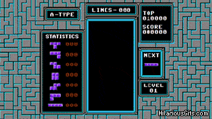

- title : Programação Funcional e Javascript
- description : Diminuindo a Dor de Cabeça no Frontend
- author : Lucas Reis
- theme : night
- transition : slide

***

# Functional Javascript
### Diminuindo a Dor de Cabeça no Frontend

***

### O que você pensa quando pensa em 100 mil linhas de Javascript?

***


***

Vamos começar a atacar essa complexidade num dos níveis mais fundamentais da programação:

### Function Design

***

## Existem apenas dois tipos de inputs e outputs para qualquer função

***

Primeiro tipo:
## Traditional

```js
const sum = (n, m) => n + m
```

Parâmetros são o *input* e o retorno é o *output* da função.

E só.

***

Segundo tipo:
## Hidden

```js
function processNext() {
  let msg = InboxQueue.getNext()

  transformMessage(msg);

  let response;

  if (msg.type === 'TYPE_A') {
    response = axios(url, { params: msg })
  } else {
    let params = { some: 'parameter' }
    response = axios(url, { params })
  }

  response.then(() => processed = true)
}
```

***


***

### Vamos refatorar!

***

Conclusão:

## Programação funcional torna sua vida mais simples!

***



***

Eu quero me beneficar das vantagens da programação funcional!

### Ótimo!

***

Continuando no mundo Javascript:

### Redux

* Um objeto como estado da aplicação
* Interações do usuário disparam *actions*
* Uma função pura chamada *reducer* recebe a action e o estado anterior e gera um novo estado
* Tem um ecossistema gigante, está virando o novo padrão

***

### Redux


***

Continuando no mundo Javascript:

### CycleJS

* Utiliza RxJS como base
* Interações do usuário são um *stream* de dados
* A UI é uma função pura desses streams
* O RxJS é um paradigma extremamente poderoso, que facilita trabalhar com concorrência, e é portado para várias linguagens

***

### CycleJS


***

Saindo do mundo Javascript...

### ClojureScript

* Linguagem super simples, fácil de entender
* Imutabilidade por default
* Macros dão uma flexibilidade para a linguagem, que permanece evoluindo
* Possui boa parte dos frameworks que influenciaram o mundo Javascript hoje: Om, Reagent e Quiescent

***

### ClojureScript


***

Saindo do mundo Javascript...

### Elm

* Toda função é pura, sempre. Nem adianta tentar
* Compilação muito poderosa, ajuda muito o desenvolvedor - *não há erros em runtime!!!*
* É uma linguagem *e* um framework, que também influenciou o mundo Javascript de hoje

***

### Elm


***

Ok, mas eu quero continuar trabalhando com orientação a objetos e acho que programação funcional é só modinha!

***

### Orientação a objetos


***

### Muito obrigado!

lucas.reis@b2wdigital.com

@iamlucasmreis

http://lucasmreis.github.io/blog/

https://github.com/lucasmreis